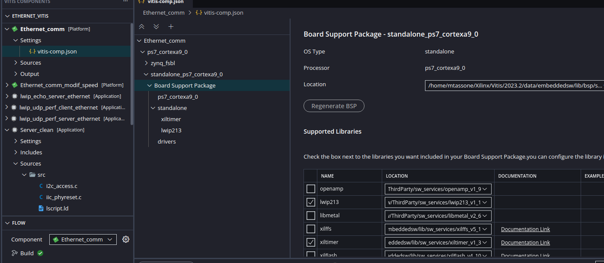
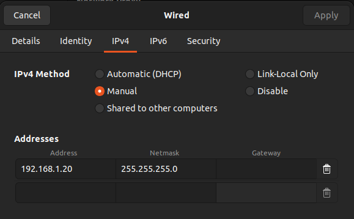
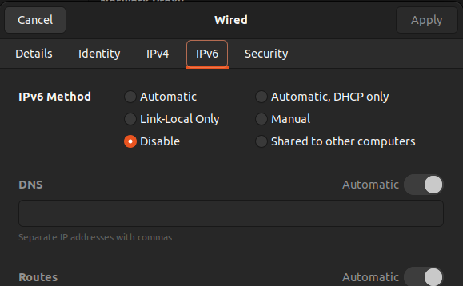

# Conexión ethernet con PYNQ-Z2

## Configuración en Vitis

Para el wrapper asegurarse que en el BSP del archivo vitis-comp.json inlcuyan las librerías lwip213 y xiltimer.



## Configuración de conexión Wired en Ubuntu

Configurar la dirección IP del cliente como cualquiera dentro de la red 192.168.1.0 manualmente y desactivar IPv6, el resto mantener automático.





## Lector de UART

Para ver los mensajes de progreso y lo recibido en la PYNQ uso la herramienta de minicom con:

```bash
sudo minicom -b 115200 -o -D /dev/ttyUSB1
```

## Pruebas

En terminal arrancar minicom con PYNQ enchufada y encendida y luego correr el código de lwip_udp_perf_server_ethernet desde vitis.

Una vez completada la conexión (avisa por UART) correr alguno de los scripts de Python. Asegurarse que la IP destino sea 192.168.1.0, que el puerto sea 5001 y completar la línea de filename con algún archivo de video en su PC.

  - Para UDP_Client_send.py:

      Envía "Hola mundo" hasta Ctrl+C del programa.

  - Para envío de video:

      -   sender_completo.py:

            Una vez corrido el programa, darle al botón de play, se muestra el video transmitido y desde la UART se leen los paquetes recibidos.
            PROBLEMA --> Error de alocación del buffer en el handler de la interrupción, no da a basto (ver xaxiemacif_dma.c de la librería lwip213, buscar "unable to alloc pbuf in recv_handler" en Vitis).

      -   sender_segmentado.py:
   
            Funciona igual que el anterior pero intenta segmentar el fotograma antes de enviarlo.
            PROBLEMA --> Se cuelga el video debido a la segmentación según el tamaño de paquete, editable en línea 39.

      
    
