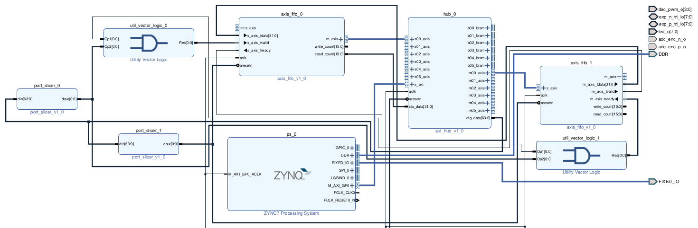

# Implementación para Red Pitaya usando repo red-pitaya-notes

## Configuración

Usando la información de la sección *Getting Started* del siguiente link

https://pavel-demin.github.io/red-pitaya-notes/playground/https://pavel-demin.github.io/red-pitaya-notes/playground/

cargo la imagen de Linux y uso el kernel de microbamba en el visual studio code.

La única configuración en Ubuntu debe ser marcar en IPv4 de la conexión wired *Share to other computers* para poder acceder a las aplicaciones de Red Pitaya desde

http://rp-f09168.local/

## Pruebas

### Pruebas sin TX/RX

Se consiguió enviar un pulso desde una interfaz master a la interfaz slave a través de 2 FIFOs y a través de los conversores DA/AD, marcando cuando la información esta lista desde un bit de configuración usado como flag

Para probarlo:

  - En la carpeta de notebooks desde el visual studio code copiar *HUB_MASTER_pulse_FIFO.py*, *loopback_FIFO_3.bit*, *HUB_MASTER_pulse_ADC.py* y *loopback_ADC_3.bit*.

  - Entrar al link http://rp-f09168.local/ y marcar *playground* para programar la FPGA por primera vez, asegurarse que se encienda el LED azul.

  - Correr el script de python que se quiera probar desde visual studio code.

### Pruebas con TX

Todas las versiones del TX funcionan igual que las pruebas anteriores. Algunos comentarios luego de varias iteraciones:

  - Las interfaces del AXI HUB tienen como puerto los address descriptos en https://pavel-demin.github.io/red-pitaya-notes/axi-hub. Según si se quiere leer/escribir es la interfaz master o slave que usa.
  
  - El tamaño de los registros de status y configuración se puede cambiar editando el bloque del AXI HUB siempre en múltiplos de 32 bits.

  - Para usar estos registros, en sus respectivos puertos y con read y write, cada 32 bits de un registro es un valor de 4 en el valor de address. Es decir, para escribir en el 2° registro de 32 bits de configuración se usa el port=0 y address=4.

  - Asegurarse que las FIFOs tengan tamaños correctos para poder leer mensajes completos, siempre de a uno.

  - El modo de implementación de lectura es con un while loop se lee el valor del registro de status correspondiente a la FIFO que se quiera leer y una vez que ese valor supera la cantidad de muestras que espero que tenga el mensaje, ahí utilizo la función de read para leer el mensaje completo desde la FIFO ya que esta función lee hasta que la FIFO esté vacía, no se le indica cuanto debe leer.

  - El reset se hace una sola vez antes de iniciar utilizando el 1° registro de 32 bits de configuración, utilizando solamente el 1° bit. No se usa la función edge porque pasa por el reset del sistema, no va directo a cada bloque.

  - El 2° registro de configuración de 32 bits se usa para indicar el 'new frame in'.

  - Los registros 3 y 4 de configuración se utilizan para cargar los valores de 'reg0' y 'reg1' del transmisor, respectivamente.

  - Todas las lecturas se guardan en archivos de texto para luego ser impresas con el *script print_from_file.py* para no graficar en runtime. La función *compare_files_v1* compara lecturas del ADC y de la FIFO y muestra la diferencia. La función *compare_and_plot_binary_files* compara el archivo data_out.mem con cualquiera de las 2 lecturas, FIFO o ADC. Se recomienda cambiar el nombre de los archivos de salida en las distintas iteraciones, modificar la variable 'base_filename'.

  - Se puede utilizar la función de requests para no tener que acceder cada vez a la página de playground, pero falla ingresando varias veces. Se recomienda mover el script *start.sh* desde playground al root de la SD de la Red Pitaya para programarlo solo al bootear.


## Diseño en Vivado

### FIFO Loopback


### ADC Loopback


# Conexión ethernet con PYNQ-Z2

## Configuración en Vitis

Para el wrapper asegurarse que en el BSP del archivo vitis-comp.json inlcuyan las librerías lwip213 y xiltimer.


## Configuración de conexión Wired en Ubuntu

Configurar la dirección IP del cliente como cualquiera dentro de la red 192.168.1.0 manualmente y desactivar IPv6, el resto mantener automático.


## Lector de UART

Para ver los mensajes de progreso y lo recibido en la PYNQ uso la herramienta de minicom con:

```bash
sudo minicom -b 115200 -o -D /dev/ttyUSB1
```

## Pruebas

En terminal arrancar minicom con PYNQ enchufada y encendida y luego correr el código de lwip_udp_perf_server_ethernet desde vitis.

Una vez completada la conexión (avisa por UART) correr alguno de los scripts de Python. Asegurarse que la IP destino sea 192.168.1.0, que el puerto sea 5001 y completar la línea de filename con algún archivo de video en su PC.

  - Para UDP_Client_send.py:

      Envía "Hola mundo" hasta Ctrl+C del programa.

  - Para envío de video:

      -   sender_completo.py:

            Una vez corrido el programa, darle al botón de play, se muestra el video transmitido y desde la UART se leen los paquetes recibidos.
            PROBLEMA --> Error de alocación del buffer en el handler de la interrupción, no da a basto (ver xaxiemacif_dma.c de la librería lwip213, buscar "unable to alloc pbuf in recv_handler" en Vitis).

      -   sender_segmentado.py:
   
            Funciona igual que el anterior pero intenta segmentar el fotograma antes de enviarlo.
            PROBLEMA --> Se cuelga el video debido a la segmentación según el tamaño de paquete, editable en línea 39.

      
    
