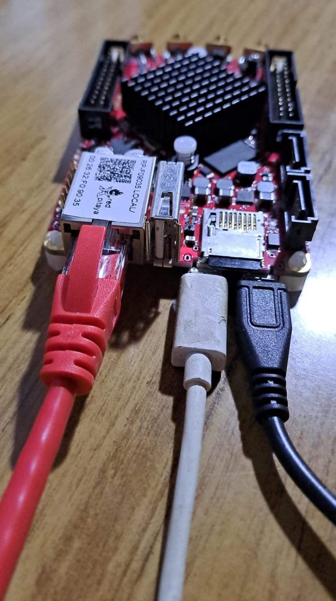
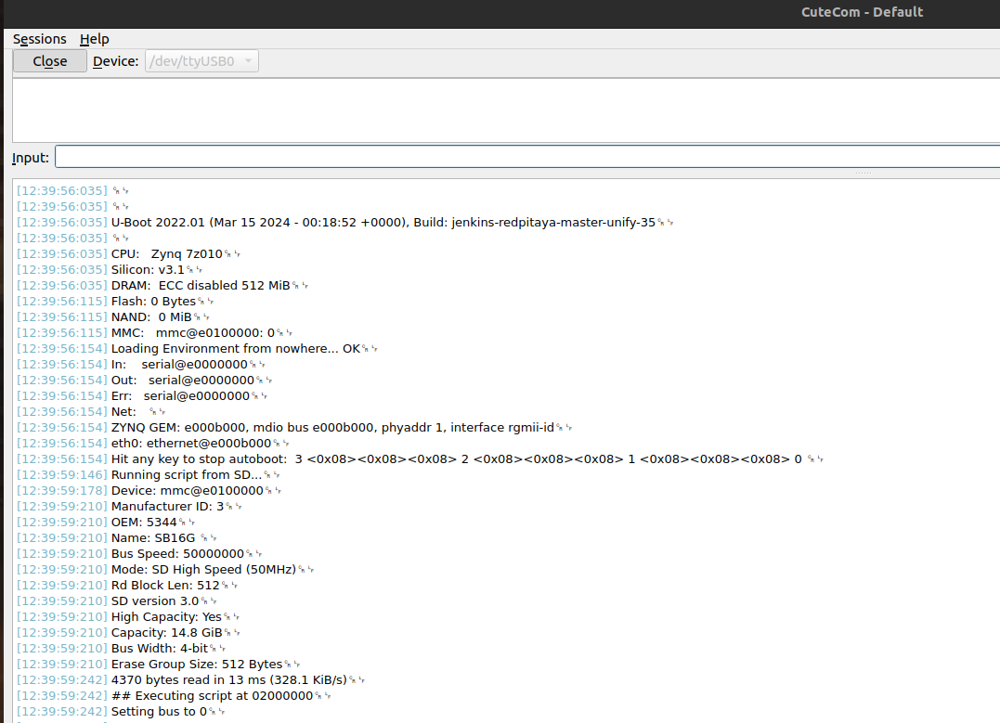
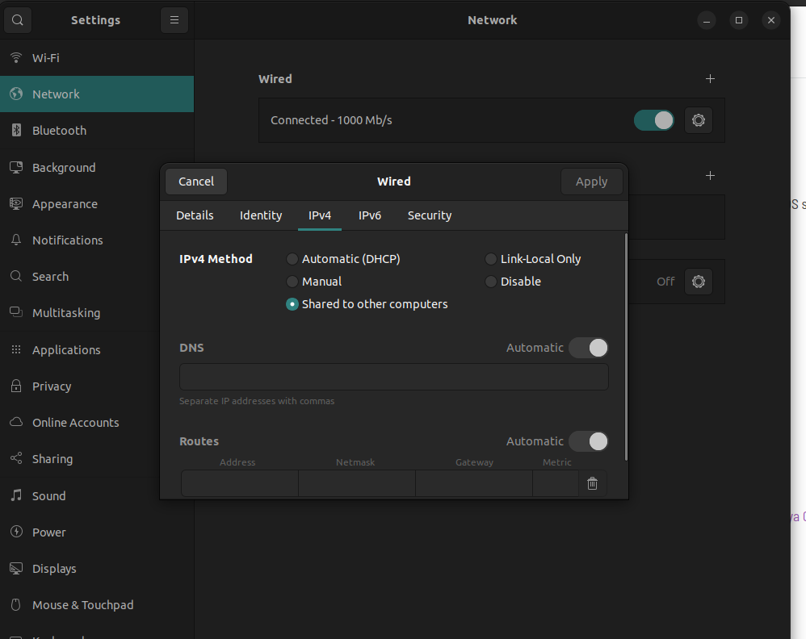
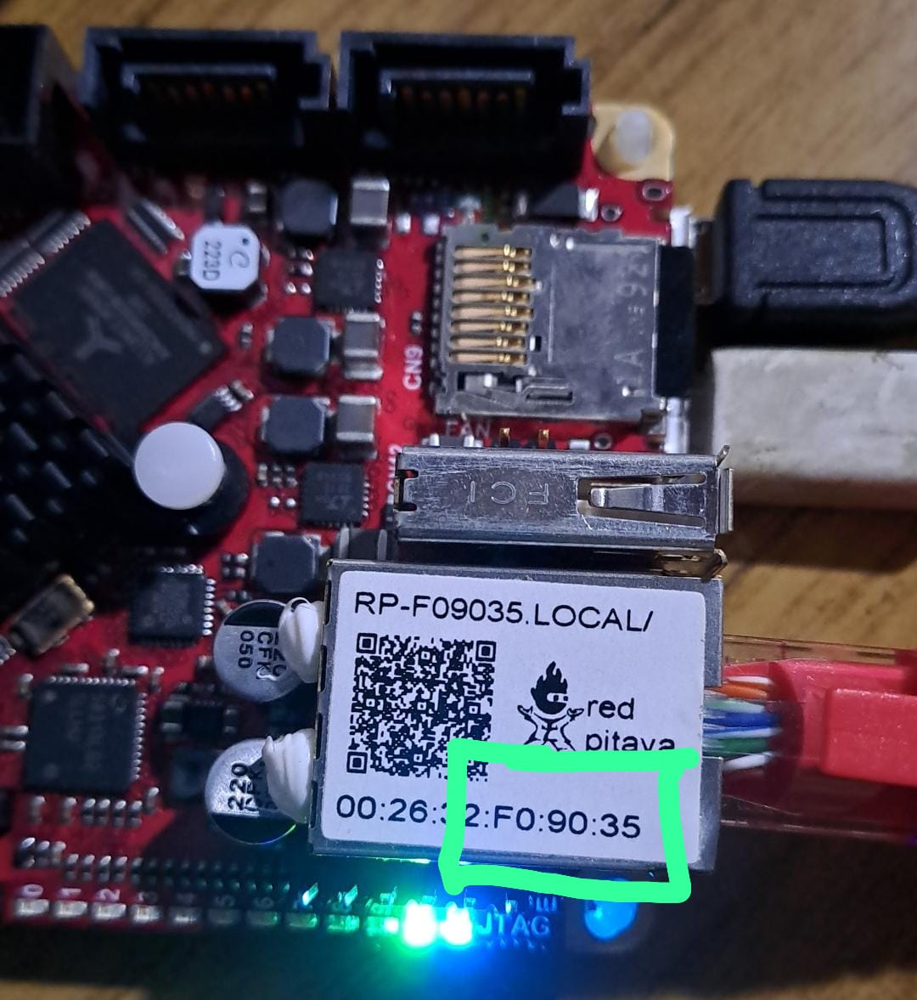
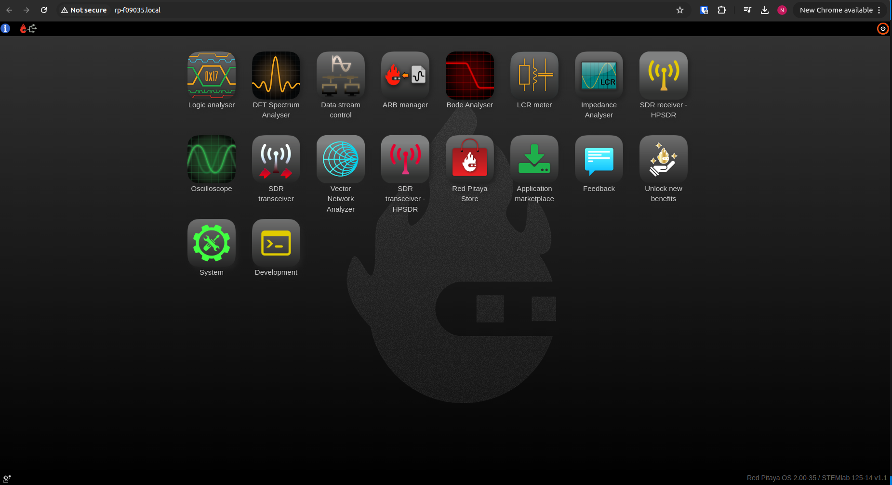
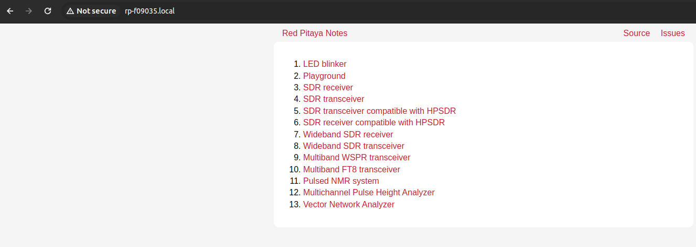

# Programando la Red Pitaya

En este repo se detallan todos los pasos necesarios para usar y/o programar la Red Pitaya.

Para más información, consultar la [documentación oficial de Red Pitaya](https://redpitaya.readthedocs.io/en/latest/intro.html)

Requisitos:

```bash
pip install libusb1
```

## Instalación de imagen oficial de Red Pitaya

La Red Pitaya tiene cinco puertos:

* Un Slot para tarjetas SD.
* Puerto Ethernet.
* Puerto USB-A.
* Puerto Micro-USB para alimentación.
* Puerto Micro-USB para comunicación USB-serial.

Primero, cargar la [imagen SD oficial](https://redpitaya.readthedocs.io/en/latest/quickStart/SDcard/SDcard.html) (se recomiendo usar [BalenaEtcher](https://github.com/balena-io/etcher)).

El setup de conexiones de la Red Pitaya debe estar como sigue:

* Cable negro es la alimentación.
* Cable blanco es la conexión USB-serial a la computadora.
* Cable rojo es el Ethernet a la computadora.
* Imagen oficial de Red Pitaya cargada en la SD.



Hay 4 leds que indican el estado de la Red Pitaya:

* **Green LED** - power good
* **Blue LED** - FPGA image loaded and OS booted
* **Red LED** - CPU heartbeat
* **Orange LED** - SD card access

Antes de energizar la Red Pitaya, abrir una aplicación para leer el USB-serial y ver la secuencia de booteo, verificando que todo esté OK (yo uso CuteCom, pero Putty or Screen también sirven):



Ahora, la conexión con la aplicación de la Red Pitaya se hace por Ethernet. Asegurarse de tener marcado en la configuración de la conexión cableada *Shared to other computers* en `Settings->Network->Wired->IPv4`.



Para conectarse a la Red Pitaya, hay dos formas:

1. Tirar el comando `arp - a` y ver la dirección IP asignada a la Red Pitaya por DHCP:

```bash
$ arp -a
# Red pitaya es 10.42.0.172
? (10.42.0.172) at 00:26:32:f0:90:35 [ether] on enp1s0
_gateway (192.168.0.1) at 82:b2:34:af:03:71 [ether] on wlp2s0
```

2. Ver el sticker pegado en la Red Pitaya, y escribir en el navegador `http://rp-xxxxxx.local`, donde "xxxxxx" son los últimos 6 caracteres de la MAC Address (para el ejemplo de la foto, la dirección es http://rp-f09035.local)





Conexión por SSH:

```bash
ssh root@rp-xxxxxx.local
# Default password "root"
```

## Instalación de la imagen de Red Pitaya Notes

Exactamente todos los pasos descritos para cargar la imagen de la Red Pitaya pueden replicarse para usar la imagen de [Red Pitaya Notes](https://pavel-demin.github.io/red-pitaya-notes/).

Para instalar la imagen, hay que tener una SD vacía y ejecutar estos comandos. Luego, copiar el contenido de la imagen de la SD de esta [referencia](https://pavel-demin.github.io/red-pitaya-notes/alpine/):

```bash
# Comandos para flashear la SD, en mi caso <your_sd_device = "sdb">
parted -s /dev/<your_sd_device> mklabel msdos
parted -s /dev/<your_sd_device> mkpart primary fat32 4MiB 100%
mkfs.vfat -v /dev/<your_sd_device_partition (should be the same name with a "1" added)>
```



Conexión por SSH:

```bash
ssh root@rp-xxxxxx.local
# Default password "changeme"
```

## Arquitectura de la Red Pitaya

Ya habiendo probado la instalación de diferentes imágenes de Linux y cómo funciona la Red Pitaya, toca entender qué pasa tras bambalinas.

La imagen oficial de Red Pitaya tiene un Ubuntu metido adentro, y la imagen de Red Pitaya Notes es un Alpine Linux. Voy a explicar Red Pitaya Notes, que es más sencillo.

Cuando uno selecciona una "aplicación", se ejecuta un script de bash `start.sh`, como el siguiente:

```bash
apps_dir=/media/mmcblk0p1/apps
source $apps_dir/stop.sh
cat $apps_dir/playground/playground.bit > /dev/xdevcfg
$apps_dir/playground/playground &
```

Este script básicamente hace dos cosas:

1. Cargar el bitstream que programa la PL de la FPGA en el archivo `/dev/xdevcfg`.

2. Ejecutar el código de la aplicación "playground" (escrito en C y compilado).

Entonces, usando Red Pitaya Notes, solamente se necesita crear el código de la aplicación y el bitstream. El Linux se encarga de programar la Red Pitaya, sin necesidad de usar un programador.

## Entorno de Python con Playground

En esta sección se analiza las capacidades del [Playground de Red Pitaya Notes](https://pavel-demin.github.io/red-pitaya-notes/playground/), aplicación que permite conectarse por Python a la Red Pitaya y configurarla directamente.

El Nico del pasado ya siguió los pasos de instalación de Micromamba y entendió que está aplicación es super simple, con mucho "bullshit" atrás. Así que voy a desglosar los ejemplos de manera muy simple.

Todo se basa en la librería también de Pavel (creador de Red Pitaya Notes) [pyhubio](https://github.com/pavel-demin/pyhubio), la cual no es más que un archivo re simple de 300 líneas. Básicamente, es una comunicación por sockets de C entre la Red Pitaya y la computadora.

Desglosemos el primer ejemplo:

```python
from pyhubio import PyhubTCP

io = PyhubTCP("10.42.0.172")
io.start()
io.program("led_blinker.bit")
io.stop()
```

Si vamos a la librería de PyhubTCP, podemos reemplazar esos llamados a función por las siguientes líneas:

```python
# This code sends a bitstream archive through sockets to program the
# Red Pitaya

## Imports
import socket
import numpy as np

## Parameters
address = "10.42.0.172"
port = "1001"
file = "led_blinker.bit"

s = socket.create_connection((address, port), 1)

# Send data and command type
data = np.fromfile(file, np.uint8)
size = data.size
command = np.uint64([2 << 52 | size << 28])
s.sendall(command.tobytes())
s.sendall(data.tobytes())

s.close()
```

Y luego podemos ver que en la Red Pitaya, se recibe el comando, se recibe el archivo, y luego se lo escribe en `/dev/xdevcfg`.

```c
if(recv(sock_client, &command, 8, MSG_WAITALL) <= 0) break;
code = command >> 52 & 0xf;
size = command >> 28 & 0xffffff;
addr = command & 0xfffffff;
switch(code)
{
case 0:
    memcpy(buffer, hub + addr, size);
    send(sock_client, buffer, size, MSG_NOSIGNAL);
    break;
case 1:
    recv(sock_client, buffer, size, MSG_WAITALL);
    memcpy(hub + addr, buffer, size);
    break;
case 2:
    recv(sock_client, buffer, size, MSG_WAITALL);
    fd = open("/dev/xdevcfg", O_WRONLY);
    write(fd, buffer, size);
    close(fd);
    break;
}
```

Entonces tenemos una comunicación con sockets desde la computadora a la Red Pitaya. No tiene sentido arreglar algo que no está roto, así que lo que se puede hacer es construir nuevos comandos (agregando más cases al switch case), y agregar preprocesamiento en C de los datos.

## Yendo más profundo el Rabbit Hole

El Ip Core AxiHub se encuentra en la dirección de memoria `0x4xyyyyyy`, donde "x" es el número de puerto e "y" es la address.

Así que, por ejemplo, si uno escribe en la (port=3, address=4), está escribiendo en `0x43000004`.

El socket acepta un comando del siguiente formato:

`uint64: command[55:52] size[51:28] address[27:0]`

Donde:

* `command` es el valor que va al switch-case
* `size` es el tamaño del mensaje a transmitir por el socket. El valor máximo está definido en el código de C como `buffer = malloc(16777216);`, donde $2^{24} = 16777216 \; [bytes]$.
* `address` se corresponde con `xyyyyyy`, los 28 bits menos significados de la dirección a escribir del AXIHub.

## Creando proyectos de Vivado

Partiendo del repositorio de [Red Pitaya Notes](https://github.com/pavel-demin/red-pitaya-notes), clonamos el repo local y ejecutamos el MakeFile, cambiando el nombre del proyecto a compilar.

```bash
git clone https://github.com/pavel-demin/red-pitaya-notes.git
cd red-pitaya-notes
# Edit Makefile "NAME" parameter
make
```

En la carpeta "temp", se van a crear todos los archivos "template" del proyecto de Vivado, que luego vamos a poder usar para modificar. Importante! Incluir la carpeta "cores", que incluye la compilación de los Ip Cores que usa el proyecto de Vivado.

Para generar los proyectos "vlc_tx" y "vlc_rx", se copio la carpeta "playground" dentro de "projects", y se cambió el nombre del proyecto en el Makefile correspondiente. Nota: los IP Cores de Red Pitaya Notes **nuevos**, es decir que no estuvieran compilados en el proyecto, generan errores. Se recomienda armar todo el código desde la carpeta de Red-Pitaya-Notes, y luego copiar el resultado en este repositorio.

Luego de hacer las modificaciones pertinentes en el proyecto, al generar el bitstream este aparece dentro de `vivado_project/vivado_project.runs.impl_1/block_design.bit`, donde "vivado_project", y "block_design" son los nombres homónimos.

## Registros de configuración

zeros[191:176]

tx_bram_size[171:160]

reg3[159:128], reg2[127:96], reg1[95:64] reg0[63:32]

| 31 | 30 | 29 | 28 | 27 | 26 | 25 | 24 | 23 | 22 | 21 | 20 | 19 | 18 | 17 | 16 |
|:--:|:--:|:--:|:--:|:--:|:--:|:--:|:--:|:--:|:--:|:--:|:--:|:--:|:--:|:--:|:--:|
|  x |  x |  x |  x |  x |  x |  read_regs |  in_sel |  x |  x |  x |  x |  2times_vlc_tx |  out_sel |  enable_fifo_out |  new_frame |

| 15 | 14 | 13 | 12 | 11 | 10 | 9 |   8  |   7  |   6  |   5  |   4  |   3  |   2  |   1  |   0  |
|:--:|:--:|:--:|:--:|:--:|:--:|:-:|:----:|:----:|:----:|:----:|:----:|:----:|:----:|:----:|:----:|
|  x |  x |  x |  x |  x |  x | nRstRxFifos | nRst | led7 | led6 | led5 | led4 | led3 | led2 | led1 | led0 |

## Registros de estado

reg3[191:160]; reg2[159:128]; reg1[127:96]; reg0[95:64]

fifoSize[63:32]

zeros[31:24]

rxFifoRegs[23:16]

| 15 | 14 | 13 | 12 | 11 | 10 |    9    |    8    | 7 | 6 | 5 | 4 | 3 | 2 | 1 |     0    |
|:--:|:--:|:--:|:--:|:--:|:--:|:-------:|:-------:|:-:|:-:|:-:|:-:|:-:|:-:|:-:|:--------:|
|  x |  x |  x |  x |  x |  x | h_error | h_ready | x | x | x | x | x | x | x | tx_ready |
